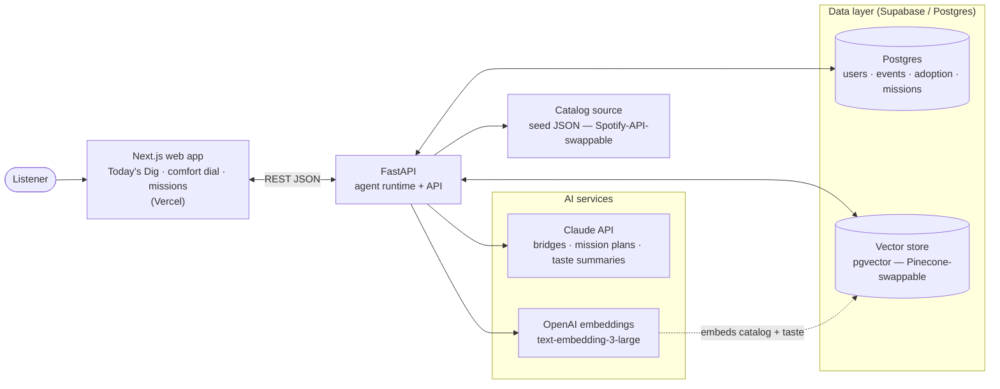
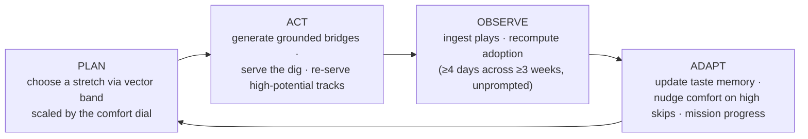
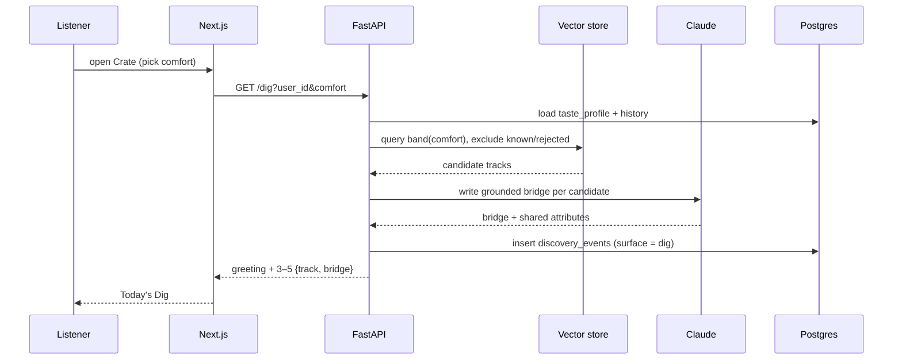
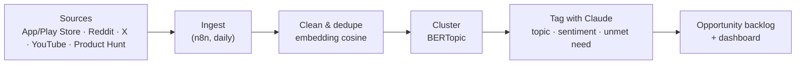

# Crate — Architecture

Crate is an **AI discovery companion** for Spotify. Unlike a recommender (which optimises the *next play*), Crate is an **agent with memory** that optimises **adoption** — turning a first play into a lasting favourite. These diagrams render natively in a GitHub README (Mermaid).

## 1. System architecture (runtime)

## 2. The agent loop (the heart of Crate)

A recommender returns a ranked list. Crate runs a **closed loop** on every `/loop/tick` (and before each dig):

## 3. Request flow — `GET /dig`

## 4. AI Review Discovery Engine (how the insights were sourced)

The product above was justified by an **insight pipeline** (n8n-orchestrated) that mined public review/forum data — the same engine described in the strategy deck.

## North Star
**Discovery Adoption Rate** — % of monthly actives who adopt ≥1 newly-discovered artist into long-term rotation (played on **≥4 distinct days across ≥3 weeks, unprompted**), with **engagement non-inferiority** as a guardrail.
