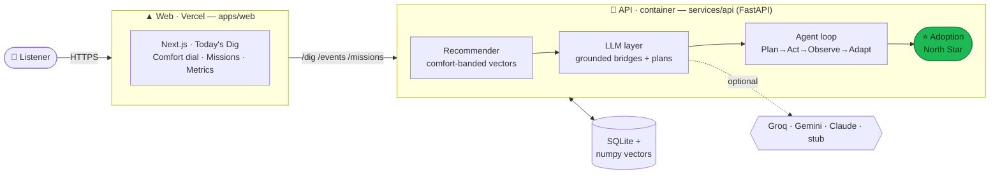
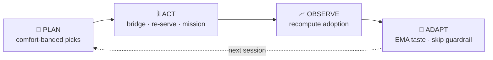
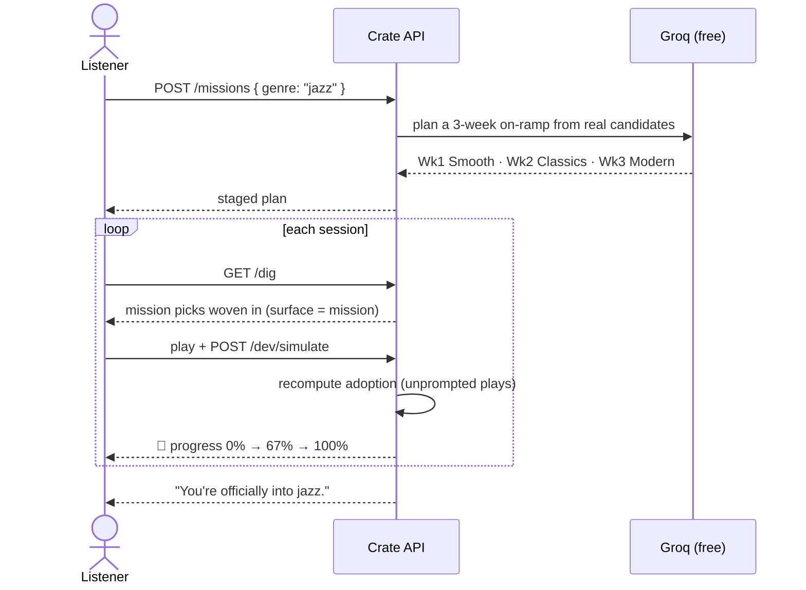
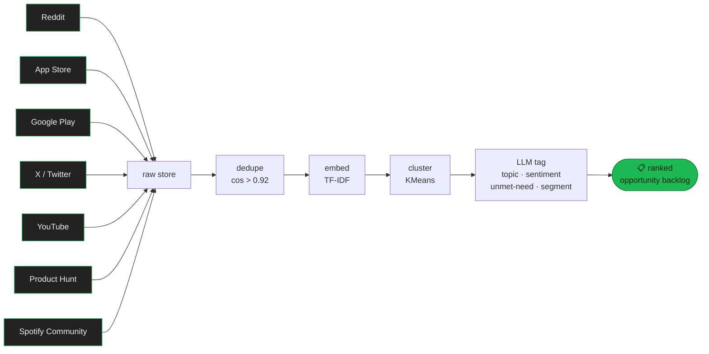
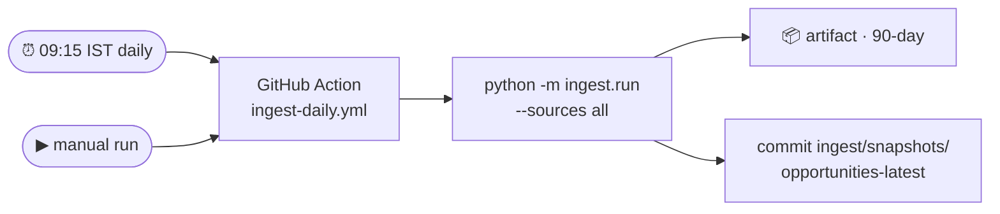

<div align="center">


# 🎧 Crate

**An AI music-discovery agent with memory — built to turn a *first listen* into a *lasting habit*.**


</div>

---

> ### 💡 The one idea
> Spotify users don't lack **recommendations** — they lack **adoption**. A win isn't *"played a new song once."* A win is **a newly-discovered artist entering long-term rotation** — played on **≥ 4 distinct days across ≥ 3 weeks, unprompted**. Everything in Crate optimises for that single outcome.
>
> Crate is an **agent with memory, not a feed**. Its loop: **Plan → Act → Observe → Adapt.**

---

## ✨ What it does

| | Feature | Why it matters |
|---|---|---|
| 🎯 | **Today's Dig** | A greeting + 3–5 new tracks, each with a **grounded "bridge"** — a one-line *why this, from what you already love*, referencing only attributes in **both** your taste and the track (never hallucinated). |
| 🎚️ | **Comfort ↔ Curiosity dial** | Slides the dig from your nearest neighbours (safe) to a bridgeable stretch (curious). |
| 🔁 | **The Adoption Loop** | Re-serves high-potential tracks (played once, not yet adopted) to convert a first play into a habit. |
| ⭐ | **North Star — Adoption Rate** | The metric that *is* the product. A **time-simulation** endpoint makes 3 weeks demonstrable in one click. |
| 🧭 | **Discovery Missions** | *"Get me into **jazz** over 3 weeks."* The agent plans a staged on-ramp (accessible → deep), weaves picks into your dig, tracks progress, and **celebrates** adoption. |
| 🛡️ | **Metrics + guardrail** | A live *surfaced → tried → adopted* funnel. Skip a lot, and the guardrail eases the dial back toward safer picks. |
| 🔍 | **AI Review Discovery Engine** | A 7-source pipeline that mines public reviews into a ranked **opportunity backlog** — the evidence behind the thesis. |

---

## 🏗️ How it works — architecture



> Everything runs **zero-setup** (SQLite + in-process numpy vectors, deterministic stub LLM). Swap to Postgres + pgvector or a real LLM by setting one env var — the interfaces are already there.

### The agent loop



### A Discovery Mission, end to end



---

## 🔬 The AI Review Discovery Engine

A separate pipeline (`ingest/`) that backs the product thesis with evidence. **7 sources behind one `Source` interface** — each with a live API path **and** a bundled offline fixture, so the whole thing runs with no keys.



The engine's **#1 ranked opportunity** is exactly Crate's founding thesis: *discovery without retention.* It answers the research brief directly — why users struggle to discover, what frustrates them about recommendations, what causes same-song loops, which segments differ, and which unmet needs recur.

### Automated daily refresh (GitHub Actions)



Any source without a secret falls back to fixtures — so the job **never hard-fails**.

---

## 🚀 Quick start (no Docker, no API keys)

**Prereqs:** Python 3.11+ and Node 18+.

```bash
# 1) API — FastAPI
cd services/api
python -m venv .venv && . .venv/Scripts/activate   # macOS/Linux: source .venv/bin/activate
pip install -r requirements.txt
python scripts/seed.py                              # idempotent: catalog + 6 personas
uvicorn app.main:app --port 8000                    # http://localhost:8000/docs

# 2) Web — Next.js  (in a second terminal)
cd apps/web
npm install
npm run dev                                         # http://localhost:3000
```

### ⚡ One-command demo (reproduces an adoption, zero setup)

```bash
cd services/api
python scripts/demo.py                              # seed → dig → play → simulate → ADOPTED
python scripts/demo.py genre-curious --mission jazz # also runs a Discovery Mission
```

Drives the whole loop in-process and **exits non-zero if nobody is adopted** — so it doubles as a smoke test.

### 🎬 The 60-second live demo

1. Pick **Noa (Active Digger)** → **Play** two tracks → hit **"Simulate 3 weeks."**
2. Watch artists cross the threshold → **Adoption Rate** jumps, 🎉 fires.
3. Drag the **Comfort ↔ Curiosity** dial → the dig visibly changes.
4. **"tell me why"** on a card → that artist vanishes next dig.
5. Switch to **Theo (Genre-Curious)** → **Start a Jazz mission** → play + simulate → progress climbs to *"you're into jazz."*

---

## 🤖 Real AI mode (optional, free)

Copy `.env.example` → `.env`. Generative text upgrades from deterministic stubs to a real LLM the moment a key is present — **Groq's free tier is the default**.

| Capability | Stub (default · free · offline) | Live |
|---|---|---|
| Bridges · summaries · mission plans · review tags | templated / deterministic | **`GROQ_API_KEY` → `llama-3.3-70b-versatile` (free)** |
| ↳ alternatives | — | `GEMINI_API_KEY` (free) · `ANTHROPIC_API_KEY` (paid) |
| Embeddings | feature-based (free) | `OPENAI_API_KEY` → `text-embedding-3-large` (paid) |

`LLM_PROVIDER=auto` resolves **groq → gemini → claude → stub**. Keys live in `.env` (gitignored) — never in `.env.example`.

---

## 🧪 Tests

```bash
cd services/api && pytest          # 40: recommender, grounding, API, adoption, missions, metrics
python -m pytest ingest/tests      # 11: source registry, fixtures, multi-source backlog (from repo root)
```

**51 tests**, all offline in deterministic stub mode (forced via `conftest.py`) — no network, no keys.

---

## 📦 Deploy

| Piece | Host | How |
|---|---|---|
| **Web** | Vercel | Root Directory = `apps/web`; set `NEXT_PUBLIC_API_BASE` to the API URL |
| **API** | Render / Railway / Fly / Cloud Run | builds `services/api/Dockerfile` (seeds on boot, serves `$PORT`); set `GROQ_API_KEY`, `ALLOWED_ORIGINS` |
| **DB** | in-image SQLite (demo) | upgrade to managed Postgres + pgvector via `DB_BACKEND`/`VECTOR_BACKEND` |

Full step-by-step in **[`DEPLOY.md`](DEPLOY.md)**. CI ([`.github/workflows/ci.yml`](.github/workflows/ci.yml)) runs tests + the adoption demo + `next build` on every push.

---

## 🗂️ Layout

```
apps/web/            Next.js (App Router, Tailwind, Spotify-dark theme)
services/api/        FastAPI agent runtime
  app/
    recommender.py     comfort-banded vector selection
    llm.py             grounded bridges · summaries · mission plans (Groq / stub)
    mission.py         staged 3-week Discovery Missions
    adoption.py        the North Star metric
    agent/             plan · act · observe · adapt
    vectorstore.py     VectorStore interface (numpy default · pgvector-swappable)
    catalog.py         CatalogSource interface (seed JSON · Spotify-swappable)
  scripts/{seed,demo}.py
ingest/              AI Review Discovery Engine — 7 sources → ranked backlog
data/                catalog.json (149 tracks) + personas.json (6 demo users)
supabase/migrations/ Postgres schema (documented prod path)
```

---

## ✅ Status

**All build-plan phases 0–10 complete & verified** — the demoable vertical slice (Today's Dig, comfort dial, adoption loop, North Star), **Discovery Missions** (Phase 7), the **metrics dashboard + engagement guardrail** (Phase 8), **delivery** (Dockerfile · Vercel · CI · one-command demo — Phase 9), and the **AI Review Discovery Engine** with **all 7 sources** (Phase 10). **51 tests green.**

<div align="center"><sub>Built as a graduation project — a narrow, lovable MVP that proves one idea: discovery is only a win when it sticks.</sub></div>
